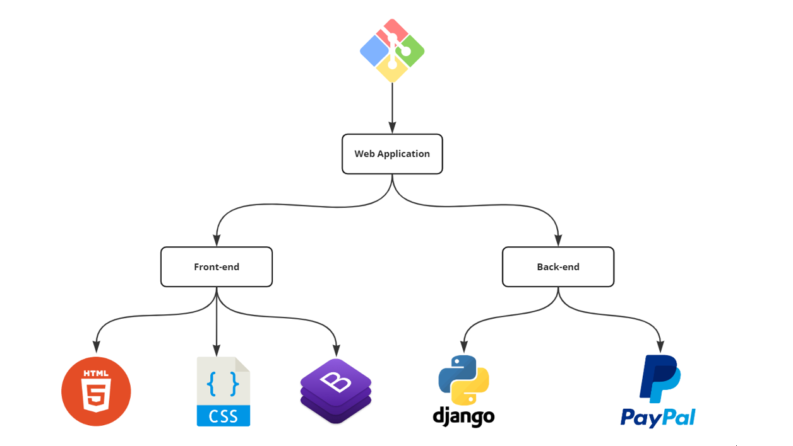
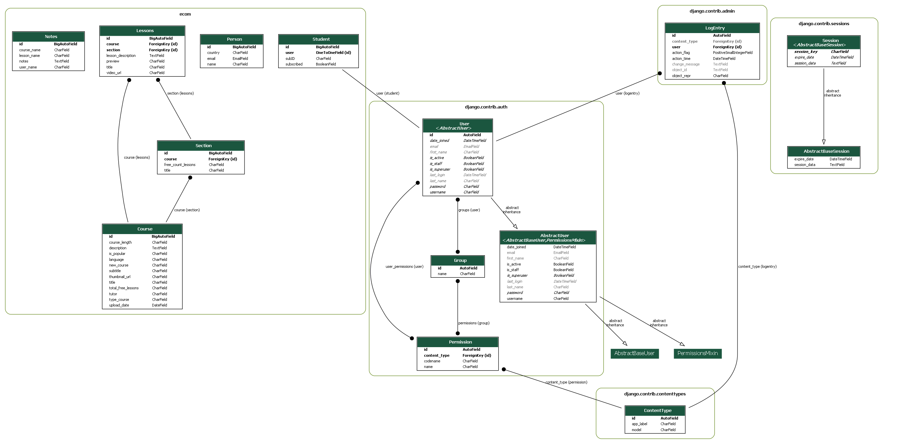

# courses-app

# Online video subscription
A project where the owner of the company sell online courses and the customers can buy the pro package for a monthly fee.

## Documentation

The technologies used for this project are: 
- For the backend:
    - Django Python framework 
    - Paypal payment gateway
- For the fronend:
    - HTML5
    - Bootstrap
    - CSS

We used also Git bash for traking any changes in any set of files from our project.

